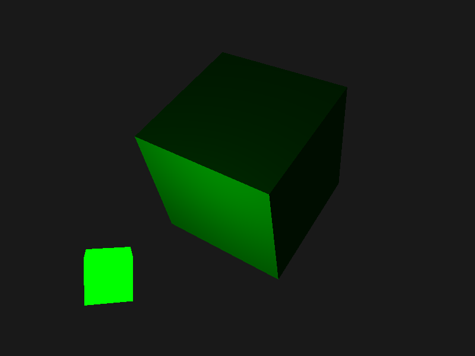

# CENGINE

This is cengine, not write using C, but use C++.

## Showcase

## 总体架构

## 执行流程

1. Cazel 是游戏引擎，其中定义了 `main` 方法
2. Sandbox 是具体的游戏，其中需要定义具体的图层，具体的应用（Application）

开始执行时：

1. `main` 方法中会调用在客户端定义的 `CreateApplication` 方法，然后执行 `run` 方法
2. `run` 方法中进行具体的 图层更新、图层渲染、事件传递 等操作

### 事件处理

1. 初始化 `Application` 时，会对 `Window` 进行事件的注册
2. 事件如 `WindowResizeEvent`, `WindowCloseEvent` 等都会先由 `glfw` 进行捕获，然后交给 `Window` 进行处理
3. 具体的事件在 `Application` 中定义，默认是对图层组进行遍历

## Reference

1. [Hazel](https://github.com/TheCherno/Hazel) by [TheCherno](https://github.com/TheCherno).
2. [spdlog](https://github.com/gabime/spdlog) by [gabime](https://github.com/gabime).
