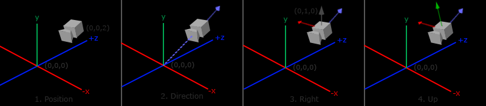

# Camera

> 观察矩阵把所有的世界坐标变换为相对于摄像机位置与方向的观察坐标。

要想定义一个摄像机，我们需要它在世界空间中的位置、观察的方向、一个指向它右侧的向量以及一个指向它上方的向量。



## 摄像机位置

摄像机位置简单来说就是世界空间中一个指向摄像机位置的向量。

## 摄像机方向

摄像机方向代表摄像机空间中的 z 轴的正方向，可以使用场景原点与摄像机位置的差作为该向量值。

## 右轴

右轴代表摄像机空间的 x 轴的正方向，为了获取右向量，我们需要先定义一个上向量(Up Vector)。接下来把上向量与摄像机方向向量进行叉乘。

```cpp
glm::vec3 up = glm::vec3(0.0f, 1.0f, 0.0f); 
glm::vec3 cameraRight = glm::normalize(glm::cross(up, cameraDirection));
```

## 上轴

既然我们有了 x 轴和 z 轴，那么获取 y 轴就很简单了。

```cpp
glm::vec3 cameraUp = glm::cross(cameraDirection, cameraRight);
```
